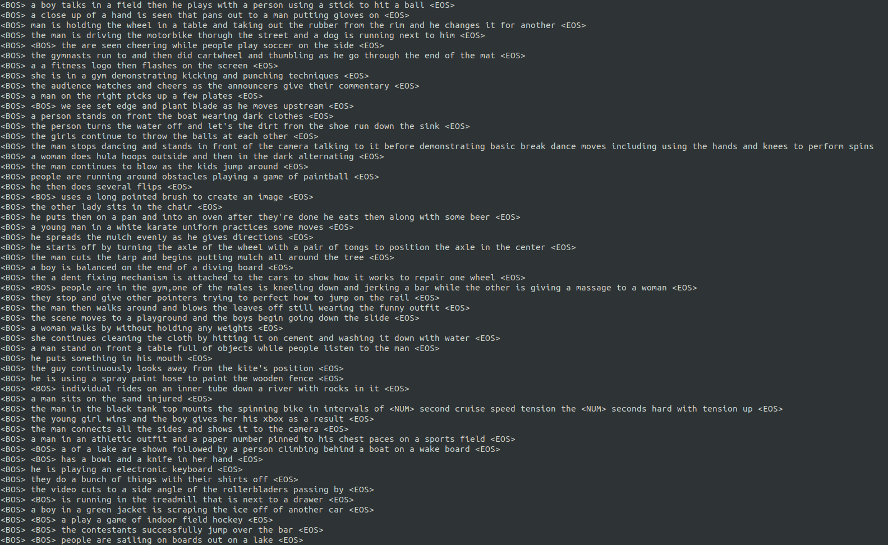

# actnetchallenge
repo for activity net challenge 2019

TO-DO:
- [x] complete script for downloading ActivityNet videos
- [x] complete script for converting .mp4 videos to .jpg frames
- [x] write dataset class for ActivityNet Captions dataset
- [x] write model for training
- [x] add optional training
- [ ] add validation and testing code
- [x] add Transformer training
- [ ] add BERT training
- [x] add character level training
- [ ] merge code

## How to download ActivityNet Captions Dataset
1. Download json file for ActivityNet dataset from [here](http://ec2-52-11-11-89.us-west-2.compute.amazonaws.com/files/activity_net.v1-3.min.json)
1. Modify `download.sh` and fix the command line argument for root directory.
1. Make sure you have at least 300GB on your storage.
1. `bash download.sh`
1. Download json files for ActivityNet Captions dataset from [here](https://cs.stanford.edu/people/ranjaykrishna/densevid/captions.zip)

## How to convert video files to image files
1. Modify `convert.sh` and fix the command line argument for root directory and where to put the metadata.
1. Make sure you have at least 1TB and enough Inodes left on your storage.
1. `bash convert.sh`

## Training procedures
1. run `getmeta.py` to fetch metadata (framerate, duration, video ids, ...) and obtain a json file with metadata
1. run `train.py` with configurations (script is in trainscripts.sh)

## Samples

### Transformer Captions
---

